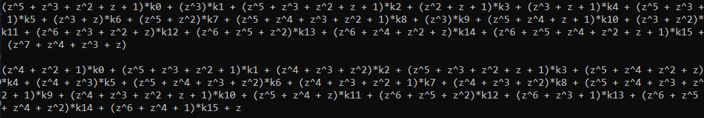

# AES Key Recovery without SubBytes

This is tool that recovers any 128-bit AES encryption key with symbolic execution when the SubBytes step is omitted.

## The motive

In the past weeks I was hearing that it is trivial to break AES if a linear SBOX is used because the entire cipher can be transformed into an affine cipher. At the same time, I was hearing about running AES with symbolic execution and while I understood the concept, I felt that I hadn't digested it.

The idea behind this little tool is to demystify AES symbolic execution for myself. I developed it shortly after UTCTF 2023 where there was a specific challenge that could be solved with this approach.

## How to run it?

Make sure you have SageMath installed in your system.

If you are a Linux user, you can run the following command as root (this might take a while):

```
apt update && apt install -y sagemath
```

If you are a Windows user, you can open up the Windows Subsystem for Linux (WSL) and run the command above.

Now you can run the python script as:


```
sage -python symbolic-aes.py
```

## How does it work?

This tool works in any case in which AES-128 skips the SubBytes step. The only thing required is an AES encryption oracle.

We prefer to encrypt 16 null bytes so that the ciphertext depends only on the key bytes.

The image below is a preview of what a symbolic ciphertext that depends only on the key bytes looks like.



Note that the coefficients are represented as elements of $GF(2^8)$.

You see only 2 equations out of the 16 in total. Notice that there are 16 unknown key bytes $k_0, k_1, ..., k_{15}$ and 16 equations so there is exactly one solution to the system.

The key recovery method expresses the ciphertext with matrices and vectors:

$$E(0) = AK + B$$

where:

  - $E(0)$ is the output of the oracle - or in other words, the encryption of the 16 null bytes.
  - $A$ is a 16x16 matrix that consists of the coefficients of the key bytes. For example, the first row of $A$ looks like $(z^5 + z^3 + z^2 + z + 1, z^3, ...\ , z^6 + z^5 + z^4 + z^2 + z + 1)$ and so on.
  - $K$ is a vector that consists of the 16 unknown key bytes $(k_0, k_1, k_2, ...\ , k_{15})$.
  - $B$ is a vector that consists of the 16 constant coefficients found in each row of the symbolic ciphertext matrix (See image above). It looks like $(z^7 + z^4 + z^3 + z, z, ...)$.

Then, with some basic linear algebra we can solve for $K$ as following:

$$K = A^{-1}(E(0) - B)$$

This is exactly what this tool calculates.

## What about next?

I was thinking of expanding this tool by implementing the following:

- Perform symbolic execution using a symbolic message vector too $(m_0, m_1, ..., m_{15})$ to see exactly how the message and the key are combined to produce the ciphertext.

- Generalize the key recovery method in the cases when AES uses a linear S-box.

## Declaration

The script `aes.py` implements standard AES operations with the SubBytes step omitted. Some of the code is taken from [this](https://github.com/bozhu/AES-Python) repository. This tool is developed for educational purposes and the rights to the reused code snippets belong to their respective author.

Last but not least, I want to thank macz for the inspiration behind this repository and all the educational discussions we have had! :)